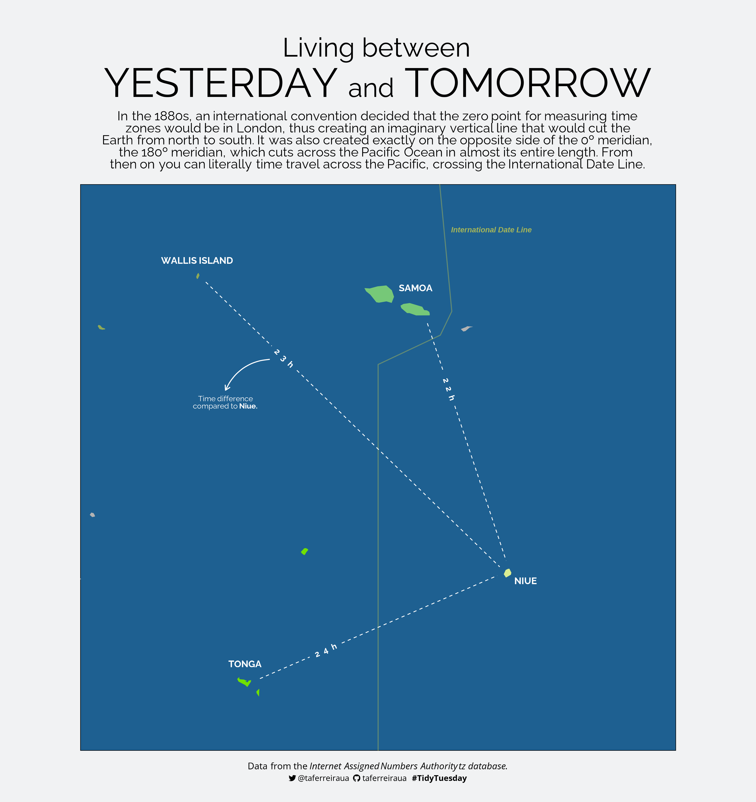
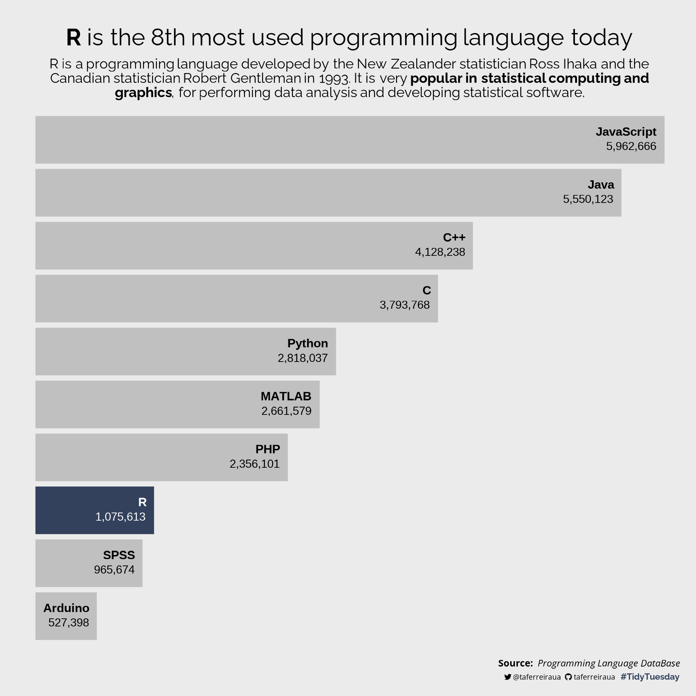
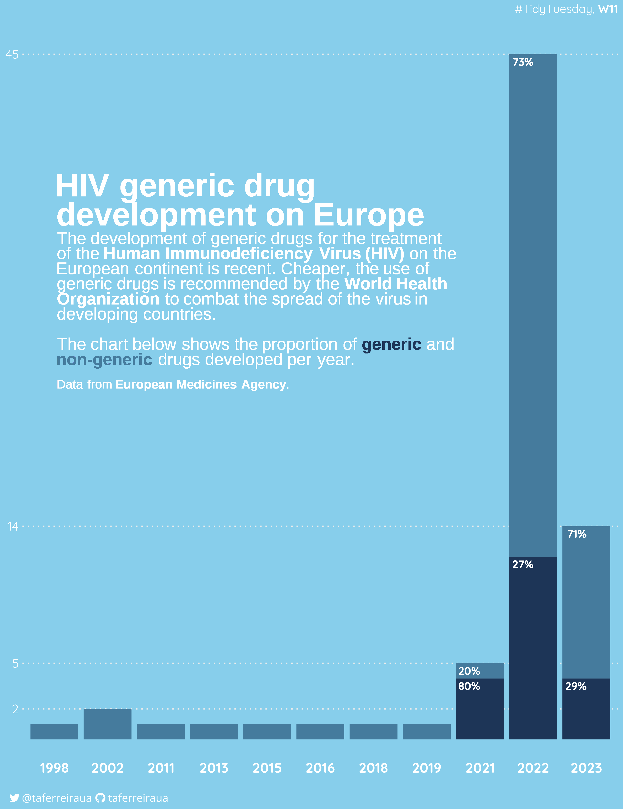

# TidyTuesday
Contribuições para a #TidyTuesday

## 2023
### **Week 13: [_Living between yesterday and tomorrow_](2023/W13/)**
  
  
### **Week 12: [_R is the 8th most used programming language today_](2023/W12/)**
  
  
### **Week 11: [_HIV generic drug development in Europe_](2023/W11/)**
  
  
### **Week 10: [_Numbats sightings recorded since 2016_](2023/W10/)**
  

### **Week 9: [_Positividade no twitter africano_](2023/W9/)**
  
