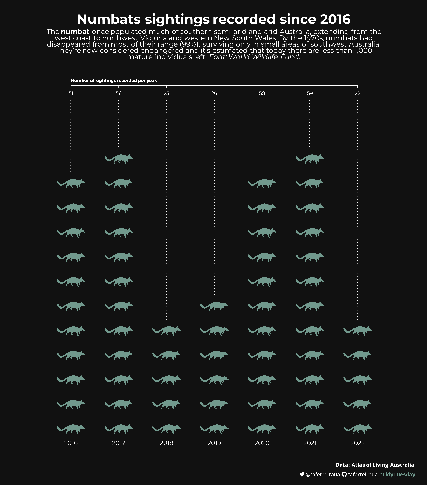

# TidyTuesday
Contribuições para a #TidyTuesday

## 2023
### **Week 13: [Living between yesterday and tomorrow](2023/W13/)**
  
  
### **Week 12: [R is the 8th most used programming language today](2023/W12/)**
  
  
### **Week 11: [HIV generic drug development in Europe](2023/W11/)**
  
  
### **Week 10: [Numbats sightings recorded since 2016](2023/W10/)**
  

### **Week 9: [Positividade no twitter africano](2023/W9/)**
  
